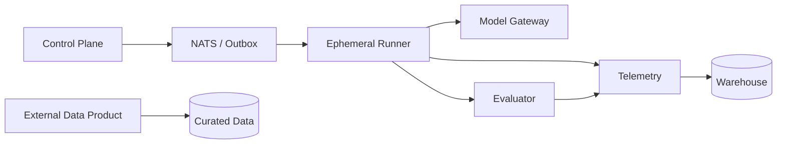

# LongHorizon

**A production-oriented research platform for measuring long-horizon software-agent reliability.**

The research question is direct: *how do memory architecture, planning strategy, context management and model choice change the reliability, cost and recoverability of autonomous software-engineering agents?*

LongHorizon treats an experiment as an auditable system: every task snapshot, model call, tool action, evaluator verdict and derived metric has a contract, lineage and retention boundary.

## Research assets

| Asset | Purpose | Status |
| --- | --- | --- |
| [Benchmark v0.1](docs/benchmark-v0.1.md) | 12 real SWE-bench Verified tasks; repository-disjoint development/holdout splits | Frozen pilot |
| [Registered protocol](docs/preregistration-v0.1.md) | hypotheses, factors, outcomes and exclusion rules | Registered pilot |
| [KPI framework](docs/kpi-framework.md) | evidence quality, reliability, safety, resilience and efficiency | Active |
| [Baseline report](reports/baseline-fixture.md) | deterministic pipeline smoke test | Simulation only |

The fixture baseline proves instrumentation, not agent capability. The real benchmark pilot is similarly not a model leaderboard: it validates task materialization, isolation and evidence capture before confirmatory runs.

## Platform architecture



- `control-plane`: idempotent experiment registration and transactional outbox.
- `runner`: sandbox-oriented contract with bounded tokens, cost and wall time.
- `model-gateway`: sole boundary for model-provider credentials and egress.
- `evaluator`: deterministic verdict contract, independent of agent logic.
- `telemetry` and `warehouse`: redacted events, lineage and curated analysis.
- `data-products`: read-only integrations that stay outside benchmark evidence.

Read the [production architecture](docs/production-architecture.md), [data architecture](docs/data-architecture.md) and [service-boundary ADR](docs/adr/0001-service-boundaries.md).

## Local research workflow

Python 3.11+ is required. Core workflows use only the standard library.

```powershell
$env:PYTHONPATH = "src;."
py -m unittest discover -s tests -v
py -m longhorizon validate-benchmark
py -m longhorizon run --config configs/experiment.local.json
py -m longhorizon analyze --results results/runs.jsonl --output results/summary.json
py -m longhorizon validate-data --runs results/runs.jsonl --events results/events.jsonl
py -m longhorizon warehouse --runs results/runs.jsonl --events results/events.jsonl --summary results/summary.json --manifest results/manifest.json --database results/warehouse.sqlite
```

For service contracts and local data products:

```powershell
py -m venv .venv
.\.venv\Scripts\python -m pip install -e ".[services]"
$env:PYTHONPATH = "src;."
.\.venv\Scripts\python -m uvicorn services.data_products.main:app --host 127.0.0.1 --port 8765
```

Open `http://localhost:8765` to view the NASA Exoplanet Archive integration. It is a data-engineering demonstrator, explicitly separate from experiment results.

## Data governance

The project uses raw -> normalized -> curated layers. Task cards and experiment outputs are validated before analytical storage; the warehouse is rebuildable from manifests and JSONL artifacts. See [the data catalog](data/catalog.json) and [contracts](schemas/).

The external NASA data product uses fixed-column TAP queries against `PSCompPars`, a 15-minute in-memory cache and response-contract checks. It neither writes to the benchmark nor enters task-success statistics.

## Evidence standard

No result is reportable unless it carries the benchmark/source hashes, configuration hash, agent image, evaluator version, model/version/decoding configuration, budgets, event trace, test output and verdict. Holdout data is never used to select agent changes.

## Current boundaries

- No provider credential, raw private repository or model output is committed.
- The current benchmark is public and historical; training-data contamination is an explicit limitation.
- A real holdout run begins only after container materialization and the selected model aliases/budgets are frozen in a tagged protocol revision.
