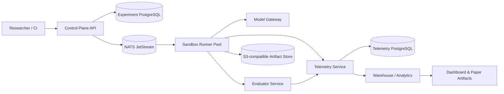

# Production architecture

The platform is designed for controlled empirical research, not autonomous deployment into customer repositories. Its production properties are reproducibility, isolation, auditability, bounded cost and recoverable execution.

## Service boundaries

| Service | Owns | Trust boundary | Scale unit |
| --- | --- | --- | --- |
| Control Plane | experiment definition, scheduler state, idempotency | authenticated research users | API replicas |
| Runner | one sandboxed task attempt | no direct database credentials; least-privilege tool allowlist | one job/pod |
| Model Gateway | provider routing, budgets, model versions | provider credentials only | API replicas |
| Evaluator | deterministic tests and verdicts | no model credentials | one evaluation job |
| Telemetry | redacted immutable event stream | validates contracts before persistence | ingestion replicas |
| Warehouse | curated analytical tables | read-only downstream consumers | scheduled transform |

## Production invariants

- An `experiment_id` is immutable and idempotent; a config/dataset hash belongs to every run.
- Every state transition emits a versioned CloudEvent contract and a correlated `trace_id`.
- Runners receive short-lived scoped credentials, use an ephemeral filesystem and have network egress denied except for approved services.
- Model invocation goes exclusively through the gateway, where token, cost, wall-clock and retry budgets are enforced.
- Raw artifacts go to object storage; PostgreSQL contains metadata and redacted event payloads only.
- A failed runner is retried only under its experiment policy; retries never overwrite a prior attempt.
- Data retention separates private raw artifacts from publishable curated aggregates.

## Deployment path

`deploy/docker-compose.yml` is an integration environment. In a cloud deployment, replace it with managed PostgreSQL, managed NATS/Kafka, private object storage, Kubernetes jobs for runners, workload identity and a secret manager. Kubernetes manifests are intentionally deferred until a cloud and identity target are selected; inventing them now would create false production readiness.

The compose environment uses explicit environment-variable placeholders for infrastructure secrets and no defaults. Store those values only in an ignored local environment file or a deployment secret manager; do not put provider keys in runners, benchmark files, telemetry or Git history.

Only the model gateway and explicitly approved read-only data products join the non-internal `egress` network. Runners, evaluators, telemetry and the control plane stay on internal networks; this makes provider egress a reviewable, auditable exception rather than a default capability.
